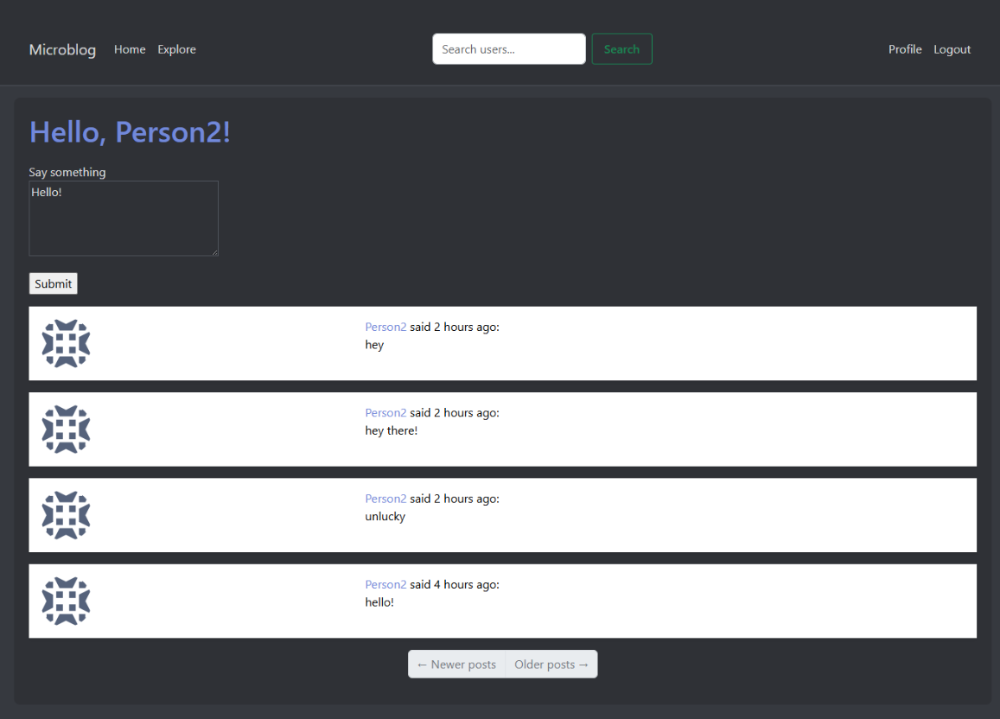

# Flask Microblog

A modern microblogging application built with Flask, inspired by Miguel Grinberg's Flask Mega-Tutorial. This project serves as an introduction to Flask development, allowing for a comparison with Django and FastAPI frameworks.



## Features

- User authentication (login/register)
- User profiles with posts and profile information
- Follow/unfollow functionality
- Post creation and display
- User search with instant results
- Pagination for posts and search results
- Modern Discord-like theme
- Responsive design

## Project Structure

```
.
├── app/                     # Application package
│   ├── static/              # Static files (CSS, images)
│   │   └── styles/         # Custom CSS
│   ├── templates/          # Jinja2 templates
│   ├── __init__.py         # Application initialization
│   ├── models.py           # Database models
│   ├── routes.py           # URL routes
│   └── forms.py            # Flask-WTF forms
├── config.py               # Configuration settings
├── microblog.py            # Application entry point
└── requirements.txt        # Project dependencies
```

## Technologies Used

- Flask (Web framework)
- SQLAlchemy (Database ORM)
- Flask-Login (User authentication)
- Flask-Migrate (Database migrations)
- Flask-Moment (Date/time handling)
- Bootstrap 5 (Frontend framework)
- SQLite (Database)

## Setup Instructions

1. Create a virtual environment:
```bash
python -m venv venv
```

2. Activate the virtual environment:
```bash
# Windows
venv\Scripts\activate

# Unix/MacOS
source venv/bin/activate
```

3. Install dependencies:
```bash
pip install -r requirements.txt
```

4. Run the application:
```bash
flask run
```

## Development Context

This project was developed as a learning exercise to understand Flask's approach to web development, particularly in comparison to Django and FastAPI. Key differences observed include:

- **Flask**: More lightweight and flexible, requiring more manual configuration. There were however many useful modules that were added to the project to make it more feature-rich.
- **Django**: More batteries-included with ORM and admin interface, but had an easier time especially integrating with larger more complex systems like in my dungeons and dragons inventory project.
- **FastAPI**: Modern, async-first approach with automatic API documentation, but was more complex to set up and required more knowledge of Python. It was very useful for creating APIs and was a lot faster than Flask, especially when I was working with real time data and spoken AI integrations. Creating web applications was a little more complex than I expected compared to Django and Flask, which can get some visible results faster.

## License

This project is for educational purposes only and is based on Miguel Grinberg's Flask Mega-Tutorial.
